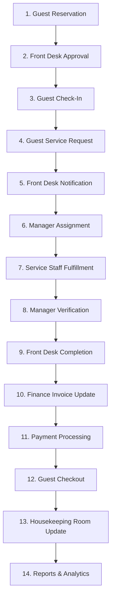

# HospEase — Smart Hotel Management System
## Frontend & Workflow Architecture Documentation

Welcome to the **HospEase** technical documentation. This document is designed to help teammates quickly understand the project structure, portal responsibilities, core state-driven workflows, notification architecture, and the complete end-to-end testing lifecycle.

---

## 1. Project Overview

*   **Project Name:** HospEase — Smart Hotel Management System
*   **Project Type:** Enterprise Hotel Management SaaS Platform
*   **Main Objective:** Automate and manage the complete hotel operations lifecycle—from guest booking and checking in, through service request assignment and fulfillment, to financial invoicing, billing, housekeeping, and analytics reporting.

HospEase uses a **centralized, role-based workflow system** that coordinates data updates across multiple microservices on the backend, while rendering tailored, restricted views on the frontend depending on the logged-in user's role.

---

## 2. Main Project Lifecycle

HospEase coordinates operations across different user roles. Below is the sequential path a guest's room booking and service requests travel through:



### Detailed Lifecycle Steps

1.  **Guest Reservation:** A guest logs in and books a room. The reservation is saved as `PENDING`.
2.  **Front Desk Approval:** The front desk reviews the booking and approves it, transitioning the reservation to `CONFIRMED`.
3.  **Guest Check-In:** Upon arrival, the front desk assigns a room and checks the guest in. The room status changes to `OCCUPIED` and reservation to `CHECKED_IN`.
4.  **Guest Service Request:** The checked-in guest submits a request (e.g., ordering food, booking spa). The service order state is marked as `SUBMITTED`.
5.  **Front Desk Notification:** The front desk receives a real-time notification, reviews the service order, and clicks **Forward to Manager** (`FORWARDED_TO_MANAGER`).
6.  **Manager Assignment:** The manager views the forwarded request and assigns it to a specific service staff member, changing the state to `STAFF_ASSIGNED`.
7.  **Service Staff Fulfillment:** The assigned service staff member accepts the task, performs the service, and marks it as completed (`STAFF_COMPLETED`).
8.  **Manager Verification:** The manager verifies that the task was executed properly and approves it (`MANAGER_VERIFIED`).
9.  **Front Desk Completion:** The front desk performs a final review and closes the request (`COMPLETED`), which posts the final service charge.
10. **Finance Invoice Update:** The finance service detects the completed order charge and adds the service cost automatically to the guest's active ledger invoice.
11. **Payment Processing:** The guest or front desk triggers payment processing. Once payment succeeds, the invoice state changes to `PAID`.
12. **Guest Checkout:** The front desk checks out the guest. The reservation becomes `CHECKED_OUT` and the room status is updated to `DIRTY`.
13. **Housekeeping Room Update:** Housekeeping cleans the room and updates its status through the cleaning workflow: `DIRTY` $\rightarrow$ `CLEANING` $\rightarrow$ `CLEAN` $\rightarrow$ `READY` (making it available for new check-ins).
14. **Reports Generation:** The system collects the financial ledger details and room occupancy counts to generate analytical reports and compliance exports.

---

## 3. Portal-Wise Explanation

HospEase provides 8 specialized dashboards, each tailoring layout features, data visibilities, and permissions according to the user's role.

### 1. Guest Portal
*   **Reservations:** Allows booking new rooms, viewing booking history, and tracking approval states.
*   **Invoices:** Interactive invoices showing room charges, tax calculations, and accumulated service order totals.
*   **Loyalty Points:** Displays points earned from room nights and service bookings.
*   **Service Requests:** Form interfaces to create service orders (Food & Beverage, Spa, Gym, Valet, etc.).
*   **Access Constraints:** Guests receive notifications but cannot access administrative, management, housekeeping, or staff pages.

### 2. Front Desk Dashboard
*   **Reservation Handling:** Displays all current bookings with quick actions to approve, reject, or modify.
*   **Check-In / Check-Out:** Handles assigning room keys at check-in, tracking guest deposits, and releasing rooms at check-out.
*   **Guest Communication:** Portal to read and respond to guests' direct messages.
*   **Request Coordination:** Reviews incoming service requests and escalates them to the Manager by clicking "Forward to Manager".
*   **Access Constraints:** No access to revenue configuration, user directory administration, or direct service fulfillment. Acts purely as a coordinator.

### 3. Manager Panel
*   **Task Assignment:** A dashboard tracking pending service orders forwarded by the front desk. Assigns work to service staff.
*   **Staff Scheduling:** Views active service staff and housekeeping shifts.
*   **Completion Verification:** Approves tasks marked complete by staff, pushing them to the front desk for final billing.
*   **Occupancy Monitoring:** Real-time metrics showing occupied rooms, cleanliness distributions, and incoming queues.

### 4. Service Staff UI
*   **Assigned Tasks:** Isolated queue showing only tasks assigned to the logged-in staff member.
*   **Task Lifecycle:** Allows staff to change task states: `Assigned` $\rightarrow$ `Accepted` $\rightarrow$ `In Progress` $\rightarrow$ `Completed`.
*   **Access Constraints:** Staff members cannot see transaction values, guest pricing, invoice totals, or other staff queues.

### 5. Housekeeping Console
*   **Room Cleaning Workflow:** Room cards indicating if a room is `DIRTY`, `CLEANING`, `CLEAN`, or `READY`.
*   **Readiness Tracking:** Housekeepers tap rooms to advance their cleanliness state.
*   **Access Constraints:** The maintenance request options have been removed to prevent duplicate tracking and keep the interface focused on room status transitions.

### 6. Finance Dashboard
*   **Invoice Generation:** Automated billing combining room rental nights with service orders.
*   **Service Charge Integration:** List of service orders linked to a room, showing detail logs.
*   **Payment & Refund Handling:** Triggers transaction receipts, marks invoices as `PAID`, or processes card and cash refunds.
*   **Formula:**
    $$\text{Final Invoice Amount} = \text{Room Rental Charges} + \text{Service Orders Charges} + \text{Applicable Taxes}$$

### 7. Admin Panel
*   **Role Management:** Dashboard to create users and assign roles (Guest, Front Desk, Manager, Staff, Housekeeper, Finance, Auditor, Admin).
*   **Permissions:** Custom rules to disable or enable feature sets.
*   **Audit Monitoring:** Log viewer showing operational and security event changes.
*   **Access Constraints:** Admin has full, unrestricted access across all portal directories.

### 8. Reporting Portal
*   **KPI Reports:** Key performance metrics including Average Daily Rate (ADR) and Revenue Per Available Room (RevPAR).
*   **Revenue & Occupancy:** Graphical breakdowns of room sales, food orders, and spa usage.
*   **Export Options:** Single-click buttons to download ledgers and reports as CSV or PDF files.

---

## 4. Role-Based Architecture & Security

HospEase uses client-side routing guards combined with backend token verification to enforce security.

| Role Code | Frontend Dashboard URL | Key Permissions |
|---|---|---|
| `GUEST` | `/guest` | Book rooms, order services, review personal invoices. |
| `FRONT_DESK` | `/frontdesk` | Approve bookings, guest check-in/check-out, forward orders. |
| `MANAGER` | `/manager` | Assign orders to staff, verify completed services, view occupancy. |
| `SERVICE_STAFF` | `/servicestaff` | Accept and complete assigned orders. No price visibility. |
| `HOUSEKEEPING` | `/housekeeping` | Update room status: Dirty $\rightarrow$ Cleaning $\rightarrow$ Clean $\rightarrow$ Ready. |
| `FINANCE` | `/finance` | Manage invoices, process payment transactions and refunds. |
| `AUDITOR` | `/reporting` | View analytics reports and export financial CSV lists. |
| `ADMIN` | `/admin` | Manage user profiles, roles, system parameters, and audits. |

---

## 5. Centralized Notification System

The notification system keeps all departments aligned in real time:

*   **Bell Component:** Located in the global top navigation header. Shows a badge indicating the number of unread notifications.
*   **Polling Cycle:** Client checks the backend notification endpoint every **10 seconds** to fetch updates.
*   **Interactive Panel:** Clicking the bell opens a dropdown listing recent alerts with buttons to mark them read.
*   **Role-Based Scope:** Notifications are filtered:
    *   *Guests* receive check-in updates and service order status changes.
    *   *Managers* receive alerts for new tasks forwarded by the Front Desk.
    *   *Staff* receive assignment alerts.
    *   *Front Desk* receive completion confirmation alerts.

---

## 6. State Management System

HospEase utilizes **Zustand** stores for fast, clean, and reactive client-side state handling.

### `workflowStore`
Tracks service request status flows:
*   `FORWARDED_TO_MANAGER`: Triggered when Front Desk escalates a guest's request.
*   `STAFF_ASSIGNED`: Updated when the Manager binds an order to a staff member.
*   `STAFF_COMPLETED`: Set by the service staff upon completing the task.
*   `MANAGER_VERIFIED`: Approved by the manager to flag the order for final checkout billing.

### `notificationStore`
Manages notification states:
*   Stores list of notifications.
*   Handles dismissals and local persistence of read notification IDs.

### `roomStatusStore`
Tracks the global state of rooms:
*   Synchronizes room states (`DIRTY`, `CLEANING`, `CLEAN`, `READY`).
*   Ensures that only rooms marked `READY` can be assigned to guests.

---

## 7. How to Run the Project

Follow these steps to start the HospEase platform locally.

### Prerequisites
*   **Java Development Kit (JDK):** Version 21 (located at `C:\Users\Kishore\Downloads\jdk-21.0.10`)
*   **Node.js:** Node 18+ and npm installed
*   **MySQL Server:** Running on port 3306

---

### Step 1: Start the Backend Services
The backend consists of 9 microservices. They must be started in order:

1.  **Service Registry (Eureka):**
    ```bash
    cd service-registry
    .\mvnw.cmd spring-boot:run
    ```
2.  **Config Server:**
    ```bash
    cd config-server
    .\mvnw.cmd spring-boot:run
    ```
3.  **Database Seeding (Optional):**
    Open your MySQL client and seed the default schemas:
    ```bash
    mysql -u root -p < seed_data.sql
    ```
4.  **Remaining Microservices:**
    Launch the rest of the services (`api-gateway`, `user-service`, `guest-reservation-service`, `room-housekeeping-service`, `service-order-service`, `finance-service`, `reporting-service`) by navigating into their directories and running:
    ```bash
    .\mvnw.cmd spring-boot:run
    ```

> [!TIP]
> You can launch all backend microservices sequentially using the preconfigured startup scripts:
> - In PowerShell: `.\start-hospease.ps1`
> - In Windows Command Prompt: `start.bat`

---

### Step 2: Start the Frontend Application
Once the backend services are running:

1.  **Navigate to the Frontend Directory:**
    ```bash
    cd frontend/hospease
    ```
2.  **Install Dependencies:**
    ```bash
    npm install
    ```
3.  **Run Development Server:**
    ```bash
    npm run dev
    ```
    The application will start on `http://localhost:3000`.

---

## 8. How to Test the Complete Lifecycle End-to-End

To verify the integration, run this test workflow:

1.  **Create Booking:** Login to the Guest Portal (`guest@hospease.com` / `Guest@123`) and submit a room booking.
2.  **Approve Booking:** Log in to the Front Desk Portal (`frontdesk@hospease.com` / `Staff@123`), navigate to **Reservations**, and click **Approve**.
3.  **Check In:** On the Front Desk **Check-In/Out** page, click **Check In** and assign a room.
4.  **Create Service Order:** Log back in as Guest. Go to **Service Requests** and submit a new request (e.g. food order).
5.  **Forward to Manager:** Log back in as Front Desk. Locate the service request on the dashboard and click **Forward to Manager**.
6.  **Assign Staff:** Log in as Manager (`manager@hospease.com` / `Manager@123`). In **Staff Scheduling**, assign the task to **Chef Carlos** (`service@hospease.com`).
7.  **Fulfill Service:** Log in as Service Staff (`service@hospease.com` / `Staff@123`). Under **Fulfillment**, click **Accept** and then **Mark Complete**.
8.  **Verify Service:** Log back in as Manager. Locate the completed task and click **Verify Completion**.
9.  **Post Billing:** Log back in as Front Desk and click **Close & Bill Request** on the verified task.
10. **Verify Invoicing:** Log in as Finance (`finance@hospease.com` / `Staff@123`). Check **Invoices & Payments** to ensure the service charge was added to the guest's ledger.
11. **Receive Payment:** In the Finance portal, process the invoice payment.
12. **Check Out:** Go to the Front Desk portal and check out the guest.
13. **Clean Room:** Log in as Housekeeping (`housekeeping@hospease.com` / `Staff@123`). Navigate to **Room Status** and transition the room from `DIRTY` $\rightarrow$ `CLEANING` $\rightarrow$ `CLEAN` $\rightarrow$ `READY`.
14. **Generate Report:** Log in as Auditor (`auditor@hospease.com` / `Staff@123`) in the Reporting dashboard to verify the updated metrics and download the updated reports.

---

## 9. Verification Checklist

Teammates should verify these items before deploying modifications:

*   ✅ **Reservation works:** Guests can book, Front Desk can approve and check in.
*   ✅ **Notifications work:** The bell badge updates and alerts dismiss correctly.
*   ✅ **Manager assignment works:** Tasks route to the specific staff queues.
*   ✅ **Service fulfillment works:** Staff completions trigger verification workflows.
*   ✅ **Invoice updates correctly:** Room fees + service orders sum up correctly.
*   ✅ **Payment works:** Payments change status to PAID and update ledgers.
*   ✅ **Room status updates correctly:** Rooms progress through the cleaning lifecycle.
*   ✅ **Reports generate properly:** Graphs load and CSV export files download.
*   ✅ **No route errors:** Clicking links routes to correct pages without 404s.
*   ✅ **No runtime crashes:** The browser console remains free of unhandled exceptions.

---

## 10. Codebase Cleanup Summary

HospEase has undergone a complete codebase cleanup:
*   **Removed Unused Files:** Deleted redundant mock schemas and databases (e.g. `mock/data.ts`).
*   **Obsolete Module Removal:** Removed the `MaintenanceRequests.tsx` module and references to keep the Housekeeping console streamlined.
*   **Clean Imports:** Cleaned up unused imports, dead route paths, and duplicate components in `AppRouter.tsx` and across the page modules.

---

## 11. Final Notes

> [!IMPORTANT]
> **Architecture Preservation**
> The existing backend microservice boundaries and frontend routing schemas have been completely preserved. Only surgical improvements have been applied: fixing workflow states, cleaning modules, updating configuration scripts, and introducing centralized, role-based checks.

*This document should help all teammates understand the complete HospEase project architecture, lifecycle workflow, portal responsibilities, and testing process.*
