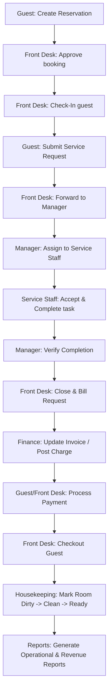

# HospEase — End-to-End Testing & Verification Manual

This document provides a comprehensive verification workflow to test the complete guest reservation, room service, assignment, billing, and reporting lifecycle of the HospEase Hotel Management System.

---

## 1. Complete Guest Lifecycle Flow (E2E)

Run this sequence step-by-step to verify the integration between all portals:



### Step-by-Step Execution Checklist

| Step | Role | Portal/Page | Action | Expected Output |
|---|---|---|---|---|
| **1** | Guest | `/login` → `/guest` | Log in as **guest@hospease.com** (Pass: `Guest@123`). Navigate to **My Reservations** → Click **Book Room**. | Reservation is created with status `PENDING` or `CONFIRMED`. |
| **2** | Front Desk | `/login` → `/frontdesk` | Log in as **frontdesk@hospease.com** (Pass: `Staff@123`). Go to **Reservations**. | The guest's reservation is visible. |
| **3** | Front Desk | `/frontdesk/reservations` | Click **Approve** on the reservation. | Status updates to `CONFIRMED`. Unread bell notification updates for Guest. |
| **4** | Front Desk | `/frontdesk/checkinout` | Find guest's reservation and click **Check In**. Assign an available room. | Room status changes to `OCCUPIED`. Reservation status changes to `CHECKED_IN`. |
| **5** | Guest | `/guest/service-requests` | Log back in as Guest. Select a category (e.g., **Food & Beverage** or **Spa**), enter description, and submit request. | Service request is created. Status shows as `SUBMITTED` in Guest workflow dashboard. |
| **6** | Front Desk | `/frontdesk` | Go to Dashboard. Locate the **Pending Service Requests** card. | The guest's new request is visible at the top. |
| **7** | Front Desk | `/frontdesk` | Click **Forward to Manager** on the request. | Notification is sent to Manager. Status updates to `FORWARDED_TO_MANAGER`. |
| **8** | Manager | `/login` → `/manager` | Log in as **manager@hospease.com** (Pass: `Manager@123`). Go to **Staff Scheduling/Tasks**. | The forwarded service request is visible in the pending assignment queue. |
| **9** | Manager | `/manager` | Select a Service Staff member (e.g., **Chef Carlos** / `service@hospease.com`) and click **Assign**. | Request status updates to `STAFF_ASSIGNED`. Task is placed in the staff member's queue. |
| **10** | Service Staff | `/login` → `/servicestaff` | Log in as **service@hospease.com** (Pass: `Staff@123`). Go to **Fulfillment** or **F&B Orders**. | **Only** this assigned task is visible (no pricing details visible). |
| **11** | Service Staff | `/servicestaff/fulfillment` | Click **Accept**, then click **Mark Complete**. | Task updates to `STAFF_COMPLETED`. Notification sent to Manager. |
| **12** | Manager | `/manager` | Go to completions verification card. Click **Verify Completion** after review. | Status updates to `MANAGER_VERIFIED`. Notification sent to Front Desk. |
| **13** | Front Desk | `/frontdesk` | Click **Close & Bill Request** on the verified request. | Request status is updated to `COMPLETED`. Service order charge is posted. |
| **14** | Finance | `/login` → `/finance` | Log in as **finance@hospease.com** (Pass: `Staff@123`). Go to **Invoices & Payments**. | Service charge is added automatically to the guest's invoice total. |
| **15** | Finance | `/finance/invoices` | Click **Receive Payment** or **Process Refund** if needed. Select Payment Method (e.g., Credit Card, Cash, UPI). | Invoice status changes to `PAID`. Overdue issues are auto-flagged if beyond check-out. |
| **16** | Front Desk | `/frontdesk/checkinout` | Locate the checked-in guest. Click **Check Out**. | Reservation changes to `CHECKED_OUT`. Room status updates to `DIRTY` (or `CLEANING`). |
| **17** | Housekeeper | `/login` → `/housekeeping` | Log in as **housekeeping@hospease.com** (Pass: `Staff@123`). Go to **Room Status**. | The room is flagged as `DIRTY`. |
| **18** | Housekeeper | `/housekeeping/room-status` | Toggle room status to `CLEANING` on start, and `CLEAN` (then `READY`) on completion. | Room status changes to `AVAILABLE` on manager review. Maintenance module links are hidden. |
| **19** | Analytics | `/login` → `/reporting` | Log in as **auditor@hospease.com** (Pass: `Staff@123`). Go to **KPIs** or **Compliance Exports**. | Operational reports are updated. Export PDF/CSV buttons export correct records. |

---

## 2. Portal-Specific Verification Checklist

### Guest Portal
- [ ] **Reservation Flow**: Creating reservations updates guest-reservation-service database schema.
- [ ] **Service Requests**: Service request tab allows selection of category and posts order with pricing.
- [ ] **Invoice View**: Interactive invoice detail layout displays room charge calculations and F&B/service item additions.
- [ ] **Notification bell**: Real-time update checks run every 10 seconds for state updates.

### Front Desk Dashboard
- [ ] **Pending Requests**: Receives and lists active guest service requests.
- [ ] **Escalation**: "Forward to Manager" button changes order state.
- [ ] **Fulfillment Closeout**: "Close & Bill" button resolves verified orders and forwards invoice updates to Finance.

### Manager Dashboard
- [ ] **Task Delegation**: Lists unassigned/forwarded service tasks and links them to service staff.
- [ ] **Verification**: Validates staff completions, triggering state transitions for billing.

### Service Staff
- [ ] **Task Isolation**: Service staff only sees tasks explicitly assigned to their employee/user ID.
- [ ] **Pricing Guard**: Revenue, invoice totals, and prices are hidden on all service staff routes.

### Housekeeping Console
- [ ] **Task/Status Flow**: Toggling room states (Dirty → Cleaning → Clean → Ready) updates the room status database.
- [ ] **Maintenance Removal**: All options to file or view maintenance requests are removed.

### Finance Panel
- [ ] **Invoice Generation**: Formula checks: $\text{Room Charges} + \text{Service Charges} + \text{Taxes} = \text{Invoice Total}$.
- [ ] **Refund Handling**: Reversing transaction charges updates payment ledger status to `REFUNDED`.

### Reports & Analytics
- [ ] **Data Export**: Financial ledger reports generate properly and export correctly to CSV files.

---

## 3. Notification Testing Protocol

Verify the following UI behaviors:
1. **Bell Badge Count**: Verify badge count increases when a new notification arrives and matches unread count.
2. **Interactive Dropdown**: Clicking the bell opens a panel showing a list of recent events.
3. **Mark as Read**: Clicking the "Mark Read" button on a notification immediately updates the badge count and stores the dismissed ID.
4. **Role Filtering**: Ensure standard staff do not receive administrative/manager-level escalation alerts.

---

## 4. Troubleshooting & Database Seeding

### Seeding MySQL Database
To clear the databases and populate demo data:
```bash
mysql -u root -p < seed_data.sql
```
*Note: If schema tables are out of sync due to enum changes, run `DROP DATABASE` as outlined in `MIGRATIONS.md`, restart the microservices to auto-generate schemas, and run `seed_data.sql` again.*

### Compilation Verification
Verify frontend build:
```bash
cd frontend/hospease
npm run build
```

Verify backend compilation:
```bash
# From workspace root
$env:JAVA_HOME = "C:\Users\Kishore\Downloads\jdk-21.0.10"
$env:PATH = "C:\Users\Kishore\Downloads\jdk-21.0.10\bin;C:\Users\Kishore\.m2\wrapper\dists\apache-maven-3.9.15\0226a00282e400185496f3b60ec5a3f029cbdc6893912937d4876d57695224e1\bin;" + $env:PATH
Get-ChildItem -Directory | Where-Object { Test-Path (Join-Path $_.FullName "pom.xml") } | ForEach-Object { cd $_.FullName; mvn.cmd compile; cd .. }
```
