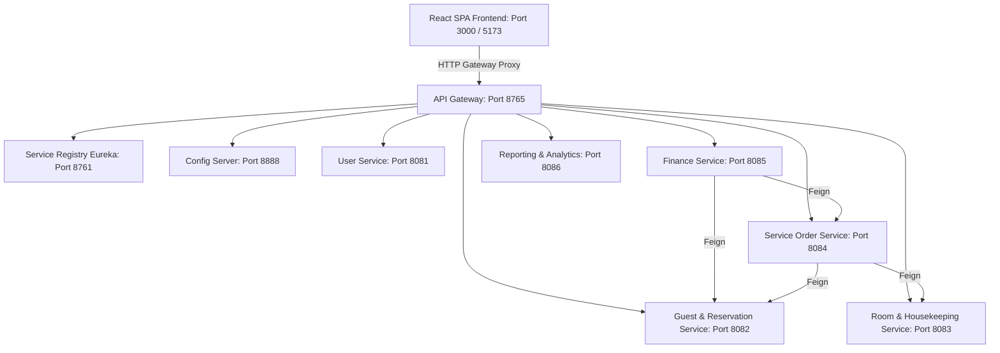

# HospEase Hotel Management System — Architecture, Lifecycle & Developer Manual

HospEase is an enterprise-grade SaaS Hotel Management platform built on a distributed Spring Cloud microservices backend and a modern React + TypeScript frontend. This document describes how the system functions, its core architectural components, the end-to-end operational lifecycle of guests and staff, default test credentials, and steps for local development.

---

## 1. Core Architecture Overview

HospEase follows a **Microservices Architecture Pattern** where each business domain runs as an independent, containerizable process with its own database schema. The services register with Netflix Eureka for service discovery, download configurations from Spring Cloud Config Server, and communicate securely via Feign clients.



### Microservice Directory & Port Mapping

1. **Service Registry ([service-registry](file:///c:/Users/Kishore/OneDrive/Desktop/frontend/frontenddemo/microhospease/service-registry) | Port 8761)**: Netflix Eureka server for service registration, lookup, and dynamic health monitoring.
2. **Config Server ([config-server](file:///c:/Users/Kishore/OneDrive/Desktop/frontend/frontenddemo/microhospease/config-server) | Port 8888)**: Pulls property configurations from the local directory [hospease-configs](file:///c:/Users/Kishore/OneDrive/Desktop/frontend/frontenddemo/microhospease/hospease-configs) to feed active microservices.
3. **API Gateway ([api-gateway](file:///c:/Users/Kishore/OneDrive/Desktop/frontend/frontenddemo/microhospease/api-gateway) | Port 8765)**: Spring Cloud Gateway filters incoming browser requests, authenticates JWT signatures using [AuthenticationGatewayFilterFactory.java](file:///c:/Users/Kishore/OneDrive/Desktop/frontend/frontenddemo/microhospease/api-gateway/src/main/java/com/hospease/filter/AuthenticationGatewayFilterFactory.java), and dynamically routes them to backend services.
4. **User Service ([user-service](file:///c:/Users/Kishore/OneDrive/Desktop/frontend/frontenddemo/microhospease/user-service) | Port 8081)**: Manages authentication, token generation, user profiles, audit logging, and Role-Based Access Control (RBAC). Key controllers: [AuthController.java](file:///c:/Users/Kishore/OneDrive/Desktop/frontend/frontenddemo/microhospease/user-service/src/main/java/com/cognizant/user_service/controller/AuthController.java) and [UserController.java](file:///c:/Users/Kishore/OneDrive/Desktop/frontend/frontenddemo/microhospease/user-service/src/main/java/com/cognizant/user_service/controller/UserController.java).
5. **Guest Reservation Service ([guest-reservation-service](file:///c:/Users/Kishore/OneDrive/Desktop/frontend/frontenddemo/microhospease/guest-reservation-service) | Port 8082)**: Coordinates guest registration, booking records, check-in and check-out tracking. Key controllers: [GuestController.java](file:///c:/Users/Kishore/OneDrive/Desktop/frontend/frontenddemo/microhospease/guest-reservation-service/src/main/java/com/cognizant/guest_reservation_service/guest/controller/GuestController.java) and [ReservationController.java](file:///c:/Users/Kishore/OneDrive/Desktop/frontend/frontenddemo/microhospease/guest-reservation-service/src/main/java/com/cognizant/guest_reservation_service/reservation/controller/ReservationController.java).
6. **Room Housekeeping Service ([room-housekeeping-service](file:///c:/Users/Kishore/OneDrive/Desktop/frontend/frontenddemo/microhospease/room-housekeeping-service) | Port 8083)**: Manages physical hotel inventory, room statuses (`AVAILABLE`, `OCCUPIED`, `CLEANING`, `MAINTENANCE`), hotel staff profiles, work shifts, and housekeeping allocations. Key controllers: [RoomController.java](file:///c:/Users/Kishore/OneDrive/Desktop/frontend/frontenddemo/microhospease/room-housekeeping-service/src/main/java/com/cognizant/controller/RoomController.java) and [HousekeepingTaskController.java](file:///c:/Users/Kishore/OneDrive/Desktop/frontend/frontenddemo/microhospease/room-housekeeping-service/src/main/java/com/cognizant/controller/HousekeepingTaskController.java).
7. **Service Order Service ([service-order-service](file:///c:/Users/Kishore/OneDrive/Desktop/frontend/frontenddemo/microhospease/service-order-service) | Port 8084)**: Feeds service bookings (Food & Beverage, Spa, Gym, Laundry). Manages state transitions, handles assignments by manager, and tracks completion. Key controller: [ServiceOrderController.java](file:///c:/Users/Kishore/OneDrive/Desktop/frontend/frontenddemo/microhospease/service-order-service/src/main/java/com/cognizant/services_service/controller/ServiceOrderController.java).
8. **Finance Service ([finance-service](file:///c:/Users/Kishore/OneDrive/Desktop/frontend/frontenddemo/microhospease/finance-service) | Port 8085)**: Aggregates room prices and service order costs to maintain invoices. Evaluates remaining balance, records payments, processes refunds, and flags overdue bills. Key controllers: [InvoiceController.java](file:///c:/Users/Kishore/OneDrive/Desktop/frontend/frontenddemo/microhospease/finance-service/src/main/java/com/cognizant/billing/controller/InvoiceController.java) and [PaymentController.java](file:///c:/Users/Kishore/OneDrive/Desktop/frontend/frontenddemo/microhospease/finance-service/src/main/java/com/cognizant/billing/controller/PaymentController.java).
9. **Reporting Service ([reporting-service](file:///c:/Users/Kishore/OneDrive/Desktop/frontend/frontenddemo/microhospease/reporting-service) | Port 8086)**: Generates hotel KPIs, audit logs, and compiles CSV reports. Key controllers: [ReportController.java](file:///c:/Users/Kishore/OneDrive/Desktop/frontend/frontenddemo/microhospease/reporting-service/src/main/java/com/cognizant/hospease/controller/ReportController.java) and [KPIController.java](file:///c:/Users/Kishore/OneDrive/Desktop/frontend/frontenddemo/microhospease/reporting-service/src/main/java/com/cognizant/hospease/controller/KPIController.java).

---

## 2. Complete End-to-End Operational Lifecycle

HospEase coordinates actions sequentially across guest, manager, front-desk, housekeeping, and finance portals in a strict transaction lifecycle:

```
[Booking Created] ➔ [Approved by Front Desk] ➔ [Checked In & Room Assigned]
       │
       ▼
[Guest Orders Service] ➔ [Forwarded to Manager] ➔ [Manager Assigns Staff]
                                                        │
                                                        ▼
[Front Desk Closes & Bills] 🖶 [Finance Recalculates] 🗘 [Staff Completes Work]
       │
       ▼
[Payment Completed] ➔ [Checked Out] ➔ [Room Dirty] ➔ [Housekeeping Cleaning] ➔ [Room Available]
```

### Step 1: Booking & Reservation (Guest Portal)
- A registered guest logs in and books a room. A reservation record is saved as `PENDING` in the database.

### Step 2: Verification & Approval (Front Desk Portal)
- The Front Desk agent views the new booking and clicks **Approve**, shifting the reservation state to `CONFIRMED`.

### Step 3: Check-In & Room Assignment (Front Desk Portal)
- Upon arrival, the agent checks in the guest, assigning an available room. 
- The room status transitions from `AVAILABLE` to `OCCUPIED`.
- The reservation status transitions to `CHECKED_IN`.

### Step 4: Service Ordering (Guest Portal)
- The checked-in guest places a service request (e.g. F&B Room Service or Spa treatment) via their portal. 
- A service order is created as `PENDING` with a specific price.

### Step 5: Escalation (Front Desk Portal)
- The Front Desk team observes the new request and forwards it to the Manager (setting custom workflow status to `FORWARDED_TO_MANAGER`).

### Step 6: Task Delegation (Manager Portal)
- The Manager views the request, checks which staff members are active on shift today (via the Live Shift Tracker), selects an assignee, and clicks **Assign**.
- This transitions the DB order status to `CONFIRMED` and the custom state to `STAFF_ASSIGNED`.

### Step 7: Fulfillment & Progress (Service Staff Portal)
- The assigned Service Staff member sees only their task in their portal.
- Clicking **Start Work** transitions the order to `IN_PROGRESS` in the database.
- Clicking **Mark Complete** transitions the custom status to `STAFF_COMPLETED` (awaiting manager review).

### Step 8: Quality Verification (Manager Portal)
- The Manager reviews the completed work on their verification card and clicks **Verify**.
- This sets the custom state to `MANAGER_VERIFIED`, notifying the Front Desk.

### Step 9: Closure & Invoice Synchronization (Front Desk & Finance Portals)
- The Front Desk clicks **Close & Bill Request**. 
- The DB status changes to `COMPLETED`.
- The Finance service recalculates the unpaid invoice automatically. Formula:
  $$\text{Invoice Total} = (\text{Nights} \times \text{Room Rate}) + \sum(\text{Completed Service Charges}) + \text{Taxes}$$

### Step 10: Checkout & Settlement (Front Desk & Finance Portals)
- The Guest or Front Desk reviews the invoice ledger and processes a payment (Credit Card, Debit Card, or Cash). The Invoice transitions to `PAID`.
- If a charge is disputed and refunded: the payment status is marked `REFUNDED`, the invoice transitions to `REFUNDED`, outstanding balance becomes `0`, and it is **not** flagged as overdue.
- The Front Desk completes check-out. The reservation transitions to `CHECKED_OUT`.
- The room transitions to `DIRTY`.

### Step 11: Cleanup & Readiness (Housekeeping Portal)
- Housekeeping staff views the dirty room.
- The housekeeper transitions the room to `CLEANING` when they start, and `CLEAN`/`READY` when finished.
- Once reviewed, the room returns to `AVAILABLE` for the next check-in.

---

## 3. Database Schemas & Seed Data Logins

Each microservice manages its own isolated MySQL database. Database migration and schemas are detailed in [MIGRATIONS.md](file:///c:/Users/Kishore/OneDrive/Desktop/frontend/frontenddemo/microhospease/MIGRATIONS.md). Initial data configuration is handled in [seed_data.sql](file:///c:/Users/Kishore/OneDrive/Desktop/frontend/frontenddemo/microhospease/seed_data.sql).

### Seed Data Credentials

For testing and demonstration, use the following logins to explore specific role-based screens:

| Portal Role | Test Username / Email | Default Password | Primary Screens / Responsibilities |
| :--- | :--- | :--- | :--- |
| **Administrator** | `admin@hospease.com` | `Admin@123` | User audits, role changes, system monitoring logs. |
| **Manager** | `manager@hospease.com` | `Manager@123` | Staff scheduling shifts, assigning service orders, live room grids. |
| **Front Desk Staff** | `frontdesk@hospease.com` | `Staff@123` | Booking approvals, room assignments, check-ins/outs, bill requests. |
| **Housekeeping Staff** | `housekeeping@hospease.com` | `Staff@123` | Room status transitions (`CLEANING` to `CLEAN`). |
| **Restaurant Staff** | `service@hospease.com` | `Staff@123` | Food & Beverage, Spa, and Gym fulfillment kanban boards. |
| **Finance Officer** | `finance@hospease.com` | `Staff@123` | Invoicing ledger, payment tracking, processing refunds. |
| **Auditor** | `auditor@hospease.com` | `Staff@123` | Exporting system KPI reports, CSV dumps, and financial graphs. |
| **Guest 1 (James)** | `guest@hospease.com` | `Guest@123` | Making room bookings, requesting service orders, processing payments. |
| **Guest 2 (Emily)** | `guest2@hospease.com` | `Guest@123` | Making room bookings, requesting service orders. |

---

## 4. Developer Quickstart Guide

Follow these steps to run the complete microservice architecture locally on your development machine.

### Prerequisites
- **Java JDK 21**: Make sure it is installed and configured in your path environment variable.
- **Node.js (LTS)**: Ensure `npm` and `node` are available.
- **MySQL Database Server**: Active local instance (running on port 3306).

### 4.1 Database Seeding
Open your MySQL shell or query client (e.g. Workbench, DBeaver) and run the seed script:
```bash
# Seed the initial databases (user_db2, room_db, guest_reservation_db, services_db, finance_db, reporting_db)
mysql -u root -p < seed_data.sql
```

### 4.2 Start the Backend Services
To run the Spring Boot microservices, you can execute the pre-configured scripts in the root directory:

**Using Windows Command Prompt:**
```cmd
start.bat
```

**Using Windows PowerShell:**
```powershell
.\start-hospease.ps1
```

*Note: The services start sequentially, allowing Eureka Registry (~35 seconds) and Config Server (~20 seconds) to spin up first, followed by the remaining functional services. Starting all services manually requires executing `mvn spring-boot:run` in each individual microservice folder.*

### 4.3 Stop the Backend Services
To shut down all backend Java processes cleanly:
```cmd
stop-hospease.bat
```

### 4.4 Run the Frontend App
1. Open a new terminal and navigate to the frontend directory:
   ```bash
   cd frontend/hospease
   ```
2. Install dependencies:
   ```bash
   npm install
   ```
3. Launch the Vite development server:
   ```bash
   npm run dev
   ```
4. Access the web app in your browser at `http://localhost:3000` (or the fallback local Vite port).

---

## 5. Security & RBAC Mechanics

- **JWT Gateway Guard**: [AuthenticationGatewayFilterFactory.java](file:///c:/Users/Kishore/OneDrive/Desktop/frontend/frontenddemo/microhospease/api-gateway/src/main/java/com/hospease/filter/AuthenticationGatewayFilterFactory.java) extracts JWTs from request headers, parses the signature, and matches the authenticated user claims before forwarding downstream.
- **Downstream RBAC Annotations**: Services use a custom `@RoleRequired` annotation to intercept controller requests and enforce role checking dynamically.
- **Frontend Role Filtering**: Views filter visual modules and hide financial/pricing figures for staff logged in under the `RESTAURANT_SERVICE_STAFF` or `HOUSEKEEPING_STAFF` roles.
